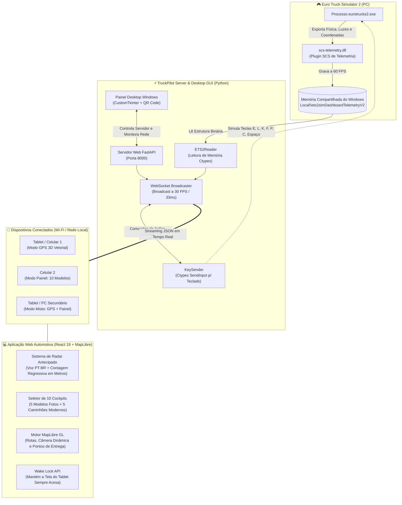
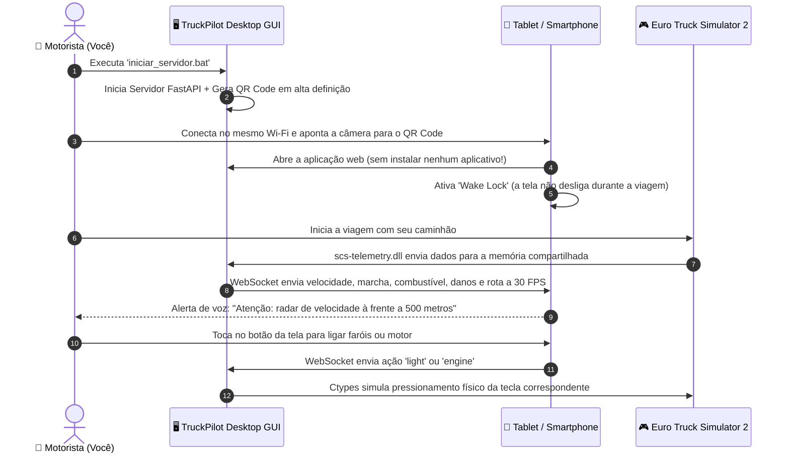

# 🚛 TruckPilot Pro — Telemetria, GPS Vetorial 3D & Cockpit Digital (ETS2)

<p align="center">
  
  
  
  
  
  
</p>

O **TruckPilot Pro** é uma central de comando e telemetria automotiva de última geração para o simulador **Euro Truck Simulator 2 (ETS2)**. Ele transforma qualquer smartphone, tablet ou monitor secundário conectado ao Wi-Fi em um cockpit profissional de caminhão, com navegação GPS vetorial 3D em tempo real, alertas sonoros de radar por voz, comandos virtuais do caminhão e **10 modelos de painéis digitais customizáveis**.

---

## 📊 Infograma da Arquitetura do Sistema



---

## 📱 Fluxo do Usuário (Do PC ao Tablet)



---

## ✨ Principais Funcionalidades

### 1. 🎨 10 Modelos de Painel Exclusivos (Modo Painel)
O usuário pode escolher seu estilo preferido através do botão seletor flutuante `🎨 Modelo`:
- **Modelos Inspirados nas Fotos de Referência:**
  - 🥇 **Modelo 1 — Aero Dual Minimal:** Cluster duplo elegante em ciano e verde, arco de velocidade de cruzeiro e relógio hexagonal.
  - 🥈 **Modelo 2 — Route Navigator:** Ponteiros analógicos esportivos vermelhos com mini-mapa esquemático de rota no centro.
  - 🥉 **Modelo 3 — Carbon Sport 4-Gauge:** Textura em fibra de carbono escura, 4 manômetros circulares analógicos com agulhas azuis e régua de inspeção de LEDs.
  - 🏅 **Modelo 4 — Sport Red Racing:** Cockpit noturno agressivo em vermelho vibrante, mostrador circular de limite da rodovia e seletor vertical PRND.
  - 💎 **Modelo 5 — Cobalt Luxury Edition:** Degradê azul cobalto premium, mostradores digitais de combustível/temperatura e luzes espias centrais.
- **Modelos Adicionais de Caminhões Modernos:**
  - 🦁 **Modelo 6 — Scania NextGen V8 Titanium:** Molduras octogonais, acabamento titânio com dourado, coroa V8 e manômetros duplos de pressão pneumática de ar (*Bar 1* e *Bar 2*).
  - 🇸🇪 **Modelo 7 — Volvo FH Globetrotter:** Estilo minimalista escandinavo em turquesa, I-Shift dinâmico e freio-motor VEB+.
  - 🌆 **Modelo 8 — Cyberpunk 2077 HUD Neon:** Estética Synthwave com malha em perspectiva 3D, barras segmentadas de LED e cores neon magenta/ciano.
  - ⭐ **Modelo 9 — Mercedes-Benz Actros Multimedia Cockpit:** Painel widescreen digital em cinza platina com assistente de condução ADAS e barras dinâmicas.
  - 🐻 **Modelo 10 — MAN TGX Bavarian Amber:** Iluminação âmbar clássica alemã, faixa de torque verde do motor D38 (1000–1400 RPM) e duplo circuito de freio a ar.
- **Painel Padrão Pro:** Mantido para o **Modo Misto** (tela dividida com o GPS) para máxima legibilidade.

---

### 2. 🚨 Detector Antecipado de Radares (Com Voz e Distância em Metros)
- Funciona tanto no **Modo GPS** quanto no **Modo Painel**.
- Detecta o radar de velocidade mais próximo pela malha de coordenadas do ETS2.
- A até **650 metros**, abre um card de alerta piscante na tela com a velocidade máxima da via e a **contagem regressiva metro a metro**.
- **Aviso Sonoro por Voz (PT-BR):** Fala automaticamente pelos alto-falantes do tablet/celular:
  > *"Atenção: radar de velocidade à frente a 500 metros. Limite de 80 km/h."*

---

### 3. 🗺️ GPS Vetorial 3D em Alta Definição (MapLibre GL)
- Mapa vetorial 3D ultrarrápido renderizado em WebGL, sem travamentos.
- Rota e trajetória traçadas com precisão sobre as rodovias do jogo.
- Seta direcional estilizada que rotaciona suavemente conforme a bússola e orientação do caminhão.
- Placa de limite de velocidade da rodovia e informações da carga (origem, destino e peso).

---

### 4. 🕹️ Controle Remoto do Caminhão (Botões de Ação na Tela)
Comande o caminhão diretamente pelo tablet ou celular através de toques na tela com feedback tátil de vibração:
- **Ligar/Desligar Motor** (Tecla `E`)
- **Farol Baixo** (Tecla `L`)
- **Farol Alto** (Tecla `K`)
- **Pisca-Alerta** (Tecla `F`)
- **Freio de Estacionamento** (Tecla `Espaço`)
- **Limpador de Parabrisa** (Tecla `P`)
- **Piloto Automático / Cruise Control** (Tecla `C`)

---

### 5. 🖥️ Painel Desktop Windows (CustomTkinter GUI)
- **QR Code Automático:** Basta apontar a câmera do celular para abrir sem digitar nenhum IP.
- **Botão "Liberar no Firewall":** Adiciona as regras necessárias no Windows Defender Firewall em 1 clique.
- **Auto-Kill de Processos Zumbis:** Elimina conflitos de porta (`Errno 10048`), liberando a porta 8000 automaticamente.
- **Monitor de Conexão:** Mostra instantaneamente se o ETS2 está aberto ou se está em modo demonstração.

---

## 🚀 Como Executar o Projeto

### Pré-requisitos
- **Windows 10 ou 11 (64-bit)**
- **Python 3.10+** instalado
- **Euro Truck Simulator 2** com o plugin de telemetria `scs-telemetry.dll`

### 1. Instalar o Plugin no Jogo (Apenas 1 vez)
Copie o arquivo `scs-telemetry.dll` para a pasta de plugins do ETS2:
```
C:\Program Files (x86)\Steam\steamapps\common\Euro Truck Simulator 2\bin\win_x64\plugins\scs-telemetry.dll
```
*(Caso a pasta `plugins` não exista, basta criá-la).*

### 2. Iniciar o Servidor
Dê um duplo clique no arquivo:
👉 **`iniciar_servidor.bat`**

A janela gráfica moderna do **TruckPilot Pro** será aberta com o **QR Code**.

### 3. Conectar Celulares ou Tablets
1. Certifique-se de que o computador e o tablet/celular estão conectados na **mesma rede Wi-Fi**.
2. Aponte a câmera do aparelho para o QR Code da tela do computador (ou digite o endereço exibido, ex: `http://192.168.1.12:8000`).
3. Toque em **[ Tela Cheia ]** no navegador e escolha a visão desejada:
   - **Painel:** Escolha entre os 10 modelos visuais disponíveis.
   - **GPS:** Mapa 3D vetorial em tempo real com alertas de radares.
   - **Misto:** Painel e mapa divididos lado a lado na mesma tela.

---

## 🛠️ Ambiente de Desenvolvimento & Compilação

### Rodar em Modo de Desenvolvimento (Live Reload)
Execute o arquivo:
```cmd
iniciar_desenvolvimento.bat
```
- Servidor Python ativo na porta `8000`
- Frontend React (Vite) com Hot Reload ativo na porta `5173`

### Compilar o Frontend
```bash
cd client
npm install
npm run build
```

### Gerar Executável Independente (.exe para Windows)
Para distribuir para amigos sem que precisem de Python ou Node.js:
```bash
python build_exe.py
```
O executável portátil será empacotado na pasta `dist/ETS2_Telemetria_Pro/`.

---

## 📂 Estrutura do Repositório

```plaintext
telemetria_eurotrucker/
├── client/                      # Frontend Web Automotivo (React 19 + Vite)
│   ├── public/                  # Mapas vetoriais ETS2, glifos e ícones
│   ├── src/
│   │   ├── components/
│   │   │   ├── skins/           # Os 10 Modelos / Skins de Cockpit
│   │   │   │   ├── SkinAeroDual.jsx
│   │   │   │   ├── SkinRouteNavigator.jsx
│   │   │   │   ├── SkinCarbonClassic.jsx
│   │   │   │   ├── SkinSportRed.jsx
│   │   │   │   ├── SkinCobaltLuxury.jsx
│   │   │   │   ├── SkinScaniaV8.jsx
│   │   │   │   ├── SkinVolvoFH.jsx
│   │   │   │   ├── SkinCyberpunk.jsx
│   │   │   │   ├── SkinActros.jsx
│   │   │   │   ├── SkinManTGX.jsx
│   │   │   │   └── index.js
│   │   │   ├── GpsView.jsx      # GPS 3D Vetorial (MapLibre GL)
│   │   │   ├── SpeedometerView.jsx # Painel com Seletor de Skins e Botões
│   │   │   └── SplitView.jsx    # Modo Misto Dividido
│   │   ├── utils/
│   │   │   ├── useRadarWarning.js # Hook compartilhado de radar com voz
│   │   │   └── wakeLock.js      # Gerenciamento de tela sempre ativa
│   │   ├── App.jsx
│   │   ├── index.css
│   │   └── skins.css            # Estilos refinados de todos os 10 modelos
├── server/                      # Servidor Backend em Python
│   ├── ets2_reader.py           # Leitura da Memória Compartilhada do ETS2
│   ├── key_sender.py            # Simulação de teclas no Windows (ctypes)
│   ├── main.py                  # API FastAPI, WebSockets e servidor de estáticos
│   └── gui.py                   # Interface Gráfica Desktop (CustomTkinter)
├── build_exe.py                 # Script de empacotamento com PyInstaller
├── iniciar_servidor.bat         # Inicializador rápido de 1 clique
├── iniciar_desenvolvimento.bat  # Ambiente integrado de desenvolvimento
├── liberar_firewall.bat         # Desbloqueio automático de rede no Windows
└── README.md                    # Documentação completa do projeto
```

---

## 📜 Licença e Créditos
- Desenvolvido para a comunidade de simuladores de caminhão (**Euro Truck Simulator 2 / SCS Software**).
- Dados de telemetria fornecidos pelo plugin comunitário `scs-telemetry`.
- Cartografia vetorial e geodados baseados nas coordenadas nativas do mapa do ETS2.
